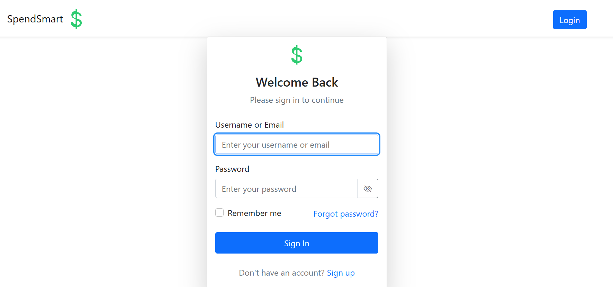
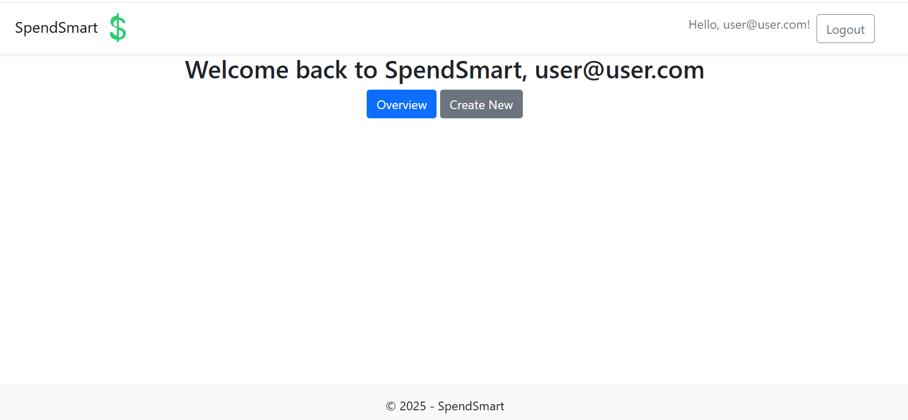
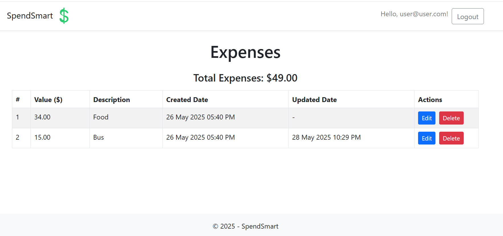
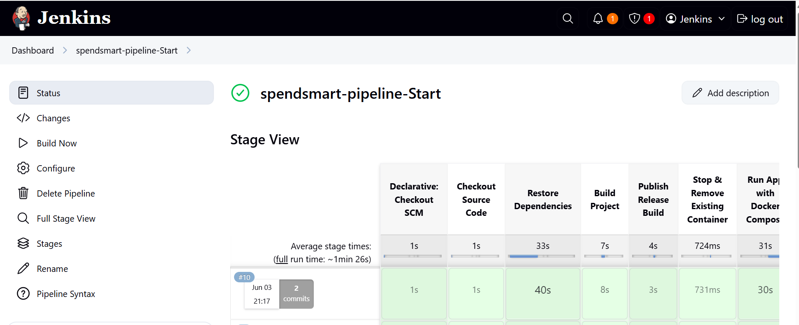
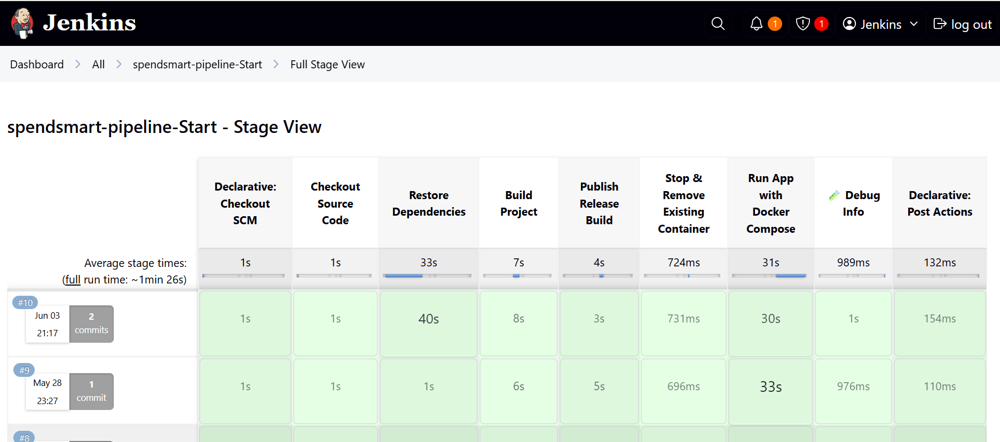
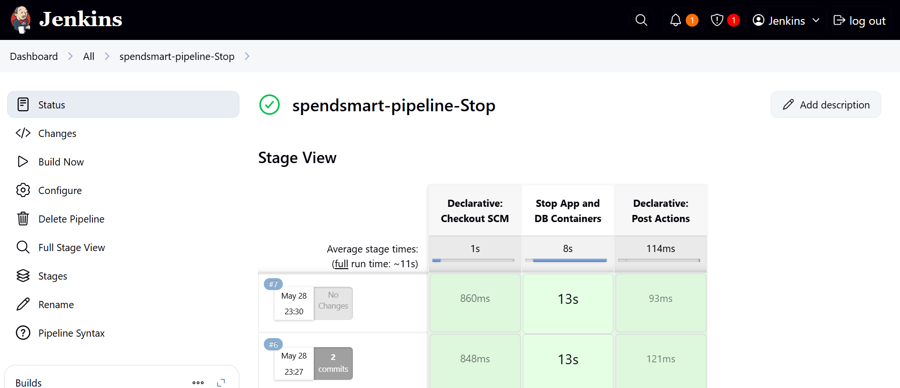
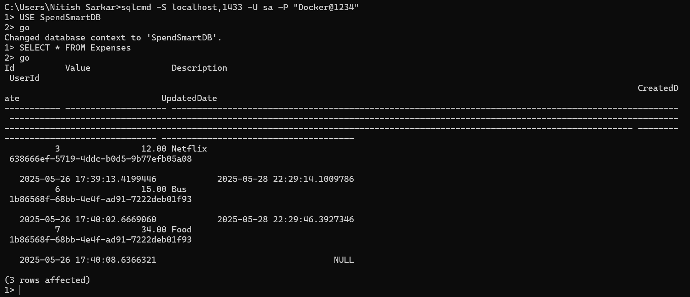

# SpendSmart - ASP.NET MVC Expense Tracker

[](https://jenkins.io)
[](https://www.docker.com)
[](https://dotnet.microsoft.com)

SpendSmart is a containerized ASP.NET MVC 8 application with cookie-based authentication, SQL Server backend, and EF Core migrations. Managed via Docker and Jenkins CI/CD.



##  Key Technologies
- **ASP.NET Core MVC 8** with Cookie Authentication
- **Entity Framework Core** (Code-first migrations)
- **SQL Server Database**
- **Docker** (Multi-container environment)
- **Jenkins** (CI/CD pipeline)

##  Authentication System
The application implements **cookie-based authentication** with:
- User registration/login functionality
- Session management via cookies
- Password hashing
- ASP.NET Identity framework
- Anti-forgery token validation
- Secure cookie settings (HTTPOnly, SameSite=Lax)

##  Cookie Security Implementation
SpendSmart uses ASP.NET Identity's cookie authentication with these security settings:

### Security Features
| Setting | Implementation | Notes |
|---------|----------------|-------|
| **HttpOnly** | Enabled (default) | Prevents client-side access to cookies |
| **SameSite** | Lax (default) | Balanced CSRF protection |
| **SecurePolicy** | Environment-aware | `None` in development, `Always` in production |
| **Expiration** | 1 minute sliding | Aggressive security posture |
| **Token Validation** | Built-in | Automatic token validation |

### Code Implementation
Security settings come from ASP.NET Identity defaults configured in `Program.cs`:
```csharp
builder.Services.AddDefaultIdentity<IdentityUser>(options => {
    // Password policy configured here
})
.AddRoles<IdentityRole>()
.AddEntityFrameworkStores<SpendSmartDBContext>();

builder.Services.ConfigureApplicationCookie(options => {
    options.LoginPath = "/Account/Login";
    options.AccessDeniedPath = "/Account/AccessDenied";
    options.ExpireTimeSpan = TimeSpan.FromMinutes(1);
    options.SlidingExpiration = true;
});
```
### Security Verification
| Environment | Cookie Security | Verification |
|-------------|-----------------|-------------|
| Development | HTTP allowed | No `Secure` flag |
| Production | HTTPS required | `Secure` flag present |
| Docker | Config-driven | Set via `ASPNETCORE_ENVIRONMENT` |

**Browser Check:** After login, verify in DevTools > Cookies:
- HttpOnly flag
- SameSite=Lax
- Secure flag (in production)

##  Why Docker?
| Benefit | Description |
|---------|-------------|
| **Consistent Environments** | Identical behavior across all systems |
| **Simplified Setup** | No manual dependency installation |
| **Isolated Services** | Web app + DB in separate containers |
| **Portability** | Runs anywhere Docker is supported |
| **DevOps Friendly** | Seamless CI/CD pipeline integration |
| **Secure Execution** | Isolated from host OS |

##  System Requirements
1. Docker Desktop ([Windows/Mac](https://www.docker.com/products/docker-desktop) | [Linux](https://docs.docker.com/engine/install/))
2. Git
3. Jenkins (for pipeline execution)

##  One-Command Setup

## 1. Clone and Launch
```bash
git clone https://github.com/your-username/SpendSmart.git
cd SpendSmart
```
## Build and start containers:
```
docker-compose up --build -d
```
## Access application:
1. Open http://localhost:9090

2. Register new account or use default(Admin) credentials:

    - Email: admin@spendsmart.com

    - Password: Admin@123

3. Start managing expenses!

## To stop:
```
docker-compose down
```
## To stop and remove the database volume (i.e., wipe data):
```
docker-compose down --volumes
```
---

##  Run via Jenkins Pipeline

This repo contains two Jenkinsfiles for CI/CD automation:

**1. jenkinsfile**
- Clones the repo

- Builds Docker images

- Starts the app using Docker Compose

How to use:

- Open Jenkins and create a new Pipeline job.

- Choose Pipeline script from SCM.

- Set repository URL to this repo.

- Set Script Path to jenkinsfile.

- Run the job to build and start the application.




**2. jenkinsfile-stop**
- Stops and removes the containers and volumes safely.

How to use:

- Create a new Pipeline job in Jenkins.

- Choose Pipeline script from SCM.

- Set repository URL to the same repo.

- Set Script Path to jenkinsfile-stop.

- Run the job to stop the application and clean up Docker resources.



---

##  Accessing the SQL Server

| Setting  | Value            |
| -------- | ---------------- |
| Server   | `localhost,1433` |
| Username | `sa`             |
| Password | `Docker@1234`    |


---

##  Project Structure
<pre>
SpendSmart/
├── SpendSmart/              # ASP.NET MVC Source
│   └── SpendSmart.csproj
├── docker-compose.yml       # Docker Compose file
├── jenkinsfile              # Jenkinsfile to build and run
├── jenkinsfile-stop         # Jenkinsfile to stop and clean
└── README.md                # This file
</pre>
---

##  Notes

- Application uses cookie-based authentication

- Database migrations run automatically on startup

- Port Configuration:

  - Jenkins maps: Host 9090 → Container 8080

  - Database: 1433 → 1433 (container)

- SQL Server password follows complexity rules

- Use docker volume ls and docker volume rm for manual volume management

##  License
MIT © 2025 SpendSmart Contributors


